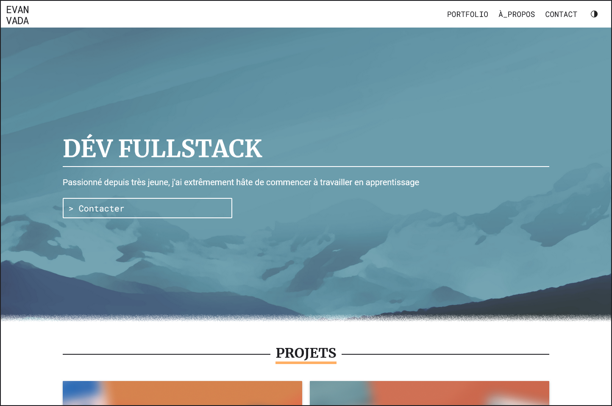

# My Portfolio Website

This is a simple static website designed to showcase my projects to interested employers.
The website is hosted on Github at [evanvada.github.io](https://evanvada.github.io/)

### Projects showcased
- The portfolio itself
- My english learning web app

## Features
- The projects will be displayed in a grid format
- Clicking on a project will redirect the user to a showcase page (that also includes my GitHub code, and a link to the application hosted on GitHub.)
- There is an "about" section displaying the skills I know and the skills I will be learning during my apprenticeship
- The user can directly send an email via the form at the bottom of the page
- The user can switch between dark and light mode in the header
- The website is responsive, with a mobile menu for smaller screens

### Technical design
I'm using BEM and the 7-1 pattern, but I'm not using Sass
- BEM is a naming convention for CSS classes that helps organize code
- The 7-1 pattern is a folder structure for organizing Sass
- I didn't use Sass because I wanted to set up my project quickly, and it remained simple enough to not need Sass

###### Tools
- plain HTML
- basic CSS
- ordinary JavaScript

###### JS files
- theme.js: This script is executed at the start of `<body>`. The default value for the theme is set by the system's preferences. It also saves user's choise into localStorage
- menu.js: Responsible for managing the mobile menu
- index.js: Specific by index.html. Allows for fast copy using `copyEmail()`. Contains a listener to the form, sending an email and handling error messages

